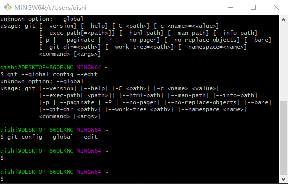

#git 实用指南
by 钱李勇   
2019.12.10

##1、git基本原理及概念
Git(读音为/gɪt/。)是一个开源的分布式版本控制系统，可以有效、高速地处理从很小到非常大的项目版本管理。它现在渐渐替代SVN成为比较主流的源代码管理工具，特别是在互联网领域。git是由大名鼎鼎的Linus Torvalds于2005年发布的。
### 1.1 集中式vs分布式
大家熟知，我们公司当前的主流源代码及文档的管理工具——SVN是一个集中式的工具，如下图所示：

图1 SVN的架构模式

&#8195;&#8195;他必需要有中央服务器才能工作，每个人的增、删、改、查都必须要通过这台中央服务器，如果这台中央服务器宕机的话，那么我们就无法管理源代码了，连查看log都不可以！它类似于我们的中央集权制度。  
&#8195;&#8195;因为SVN的这种特性有一个突出的问题是无法本地管理自己本地的代码！假设某个同事接到了一个新需求的开发，那么它要么在中央服务器上新建一个分支，而SVN本身是不擅长于分支管理的，而且每个人都在SVN中央服务器上建立分支，会显得非常混乱。  
&#8195;&#8195;git是跟SVN完全不同的架构模式，其工作原理类似于区块链的去中心化策略，其架构模式如下图所示：  

  

图2 git的架构模式
  

&#8195;&#8195;git的这种分布式架构模式使其完全可以没有“中央服务器”的存在而脱机工作。每个人在本地都存在了完整的版本库，也可以在不联网的情况下就可以做版本管理，这个特性初看感觉没什么了不起，但是他的重要性是每个人自己可以管理自己的代码了，如果两个人协作开发，只要这两台机器连接，将各自的修改推送给对方，就可以看到对方的修改了。但是，一般如果一个公司以git作为版本管理工具的话，不会这么做，为了提高工作效率，通常还是会有一台24小时工作的“中央服务器”，方便大家提交修改。但他与SVN不高之处是，没了“中央服务器”，我本地照样能正常工作。  
###1.2 工作区、暂存区、版本库  
&#8195;&#8195;工作区非常容易理解，比如我们建立了一个`PlaySDK`的文件夹，我们想管理这个文件夹下的代码工程及其文件、依赖库等等，那么`PlaySDK`就是我们的工作区。  
&#8195;&#8195;在创建了git仓的工作区，会隐藏着一个`.git`的文件夹，这个文件夹被称为版本库。里面存放着非常多有用的东西，其中一个重要的东西是stage，就是暂存区，暂存他是介于本地文件修改与被版本跟踪之间的一个状态，这个时候，如果你提交，那么这个修改的文件就正式被纳入了分支被管理起来，如图2,图3所示：    

    

图2 添加文件至暂存区
    

    

图3 提交至分支
  
&#8195;&#8195;这两步操作构建出了git的最基本的工作方式，我们所有的代码提交至分支，都需要将修改先放至暂存区。

##2、git使用套路
### 2.1 git仓初始化   
&#8195;&#8195;git是Linus开发的，所以可想而知，其是继承了linux的操作习惯，比如强大的命令行操作，在windows上，git需要运行于mingw64，一般从官方下载的git安装包已经非常傻瓜化，只要下一步下一步就可以了。由于在windows上还是习惯于有界面的东东，所以，这里再推荐一个工具——tortoiseGIT，没错，就是那个熟悉的“乌龟工具”的git版本。这两个一起使用，各取所长，达到事半功倍的效果。图3就是git起来后的样子，浓浓的linux风。

    

图4 git-bash界面
  
&#8195;&#8195;打开git-bash，首先通过`git config --global --edit`命令初始自己的用户名和邮箱，作为自已的ID。这一步配置后，就正式开始了git之旅
&#8195;&#8195;git仓的初始化。在一个工程让git管理之前，必须要在工程下创建一个git仓，命令如下：    

	cd dir    #进入到工作目录          
	git init  #建立工作仓  
### 2.3 检出代码
### 2.4 创建分支
### 2.5 将代码添加至暂存区  
### 2.6 提交代码
### 2.7 合并代码   
### 

##3、SVN与git的结合使用
##附、git命令小结